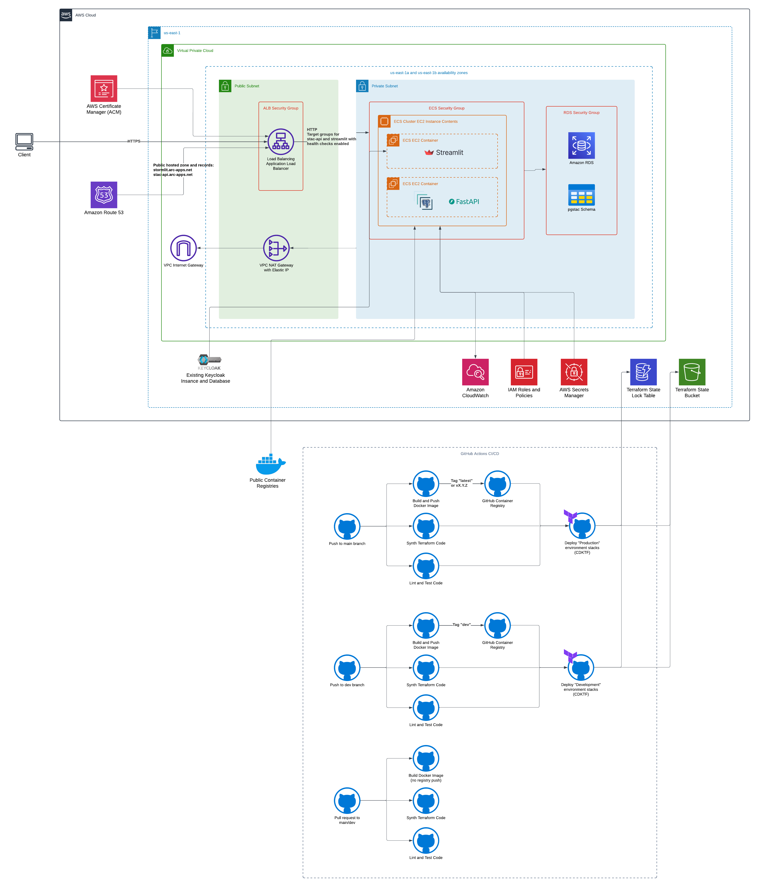

# stormlit
A streamlit application designed for interacting with probabilistic flood hazards modeling data

[](https://github.com/fema-ffrd/stormlit/actions/workflows/deploy.yml)
[](https://github.com/fema-ffrd/stormlit/actions/workflows/docker-scout.yml) 

## Stormlit Development Environment
The development container provides a consistent environment for Stormlit development with Python (via Micromamba), Node.js, AWS CLI, CDKTF, PgStac API, and PostgreSQL.

### Prerequisites Installation

1. Install Docker Desktop:
   - Windows/Mac: Download from [Docker Desktop](https://www.docker.com/products/docker-desktop)
   - Linux: Follow [Docker Engine installation](https://docs.docker.com/engine/install/)

2. Install VS Code:
   - Download from [Visual Studio Code](https://code.visualstudio.com/)

3. Install VS Code Extensions:
   - Open VS Code
   - Press Ctrl+Shift+X (Windows/Linux) or Cmd+Shift+X (Mac)
   - Search and install "Dev Containers"

### Setup Steps

1. Clone the repository:
```bash
git clone https://github.com/fema-ffrd/stormlit
cd stormlit
```

#### VS Code Dev Container Setup
If not using dev containers, skip to
[Docker Compose Setup](#docker-compose-setup) below.
2. Open in VS Code:
```bash
code .
```

3. Start Dev Container:
   - Press F1 or Ctrl+Shift+P
   - Type "Dev Containers: Open Folder in Container"
   - Select your project folder
   - Wait for container build (~5-10 minutes first time)

Continue to [Verify Services](#verify-services).

#### Docker Compose Setup
1. Build Docker images for the environment.
```bash
docker compose build
```

2. Start the application and services.
```bash
docker compose up
```


#### Verify Services
4. Verify services:
   - Open browser: http://localhost:8080 (PgStac API)
   - Open browser: http://localhost:55050 (pgAdmin)
     - Login: admin@example.com/admin
     - Add server:
       1. Right click "Servers" → "Register" → "Server"
       2. Name: "Stormlit DB"
       3. Connection tab:
          - Host: stormlit-pgstac
          - Port: 5432
          - Database: postgis
          - Username: postgres
          - Password: password

5. Start developing:
   - Code is synced between your machine and container
   - Python environment is pre-configured
   - Terminal in VS Code uses the container environment

#### Setup Troubleshooting: SSL Errors in VPN Environments
If encountering SSL errors while building the dev container
environment, check if you are on a corporate VPN which
does man-in-the-middle SSL inspection with certificate
replacement (e.g., Zscaler). Programs running within the
dev container need to "trust" the Root Certificate
Authority of your VPN.

Obtain the Root CA in `PEM` format, put it in a text
file with the extension `.crt`, and place it in the
`./devcontainer/` folder. Then, rebuild the dev
container environment. This will allow the dev container
to build without SSL errors.

Additonal configuration may be necessary to allow the
Stormlit app container to connect to online resources
without SSL errors. First, create a CA bundle by
concatenating the Root CA with, e.g., [the Mozilla
certificate bundle distributed with the Python certifi
library](https://github.com/certifi/python-certifi/blob/master/certifi/cacert.pem),
and name it with a `.crt` extension. Then, modify
your `./app/.env` file with environment variables
to ensure that Stormlit uses the Root CA:
```sh
REQUESTS_CA_BUNDLE=/workspace/.devcontainer/zscaler-certifi-ca-bundle.crt
SSL_CERT_FILE=/workspace/.devcontainer/zscaler-certifi-ca-bundle.crt
```

### Base Image and Features
- Base image: `mcr.microsoft.com/devcontainers/base:jammy`
- Python environment managed by Micromamba
- Node.js LTS
- AWS CLI
- CDKTF v0.20.10

### Services

#### PgStac API
- Container: `stormlit-stac-api`
- URL: http://localhost:8080
- Backed by PostgreSQL with PostGIS extension and PgStac Schema

#### PostgreSQL
- Container: `stormlit-pgstac`
- Port: 55432
- Database: postgis
- Credentials: postgres/password
- Volume: stormlit-pgstac-data

#### pgAdmin (Database Management)
- Container: `stormlit-pgadmin`
- URL: http://localhost:55050
- Login: admin@example.com/admin

### Environment Configurations
- Python path: `/opt/conda/envs/stormlit/bin/python`
- Workspace mounted at: `/workspace`
- Environment file: `/workspace/env.yml`

### Included VS Code Extensions
- Python
- Ruff
- GitHub Copilot

### Post-Creation Commands
The container automatically:
- Sets workspace ownership to vscode user
- Initializes Micromamba shell
- Activates stormlit environment
- Configures Git safe directory

### Networking
All services are connected via `stormlit-network` for internal communication.

### Data Persistence
- PostgreSQL data: `stormlit-pgstac-data` volume
- Project files: Mounted from host at `/workspace`


## Running Streamlit

### Local Development
```bash
# In VS Code terminal
cd app
streamlit run src/main.py
```
Access at http://localhost:8501

### Environment Variables
1. Copy the template:
```bash
cd app
cp .env.template .env
```

2. Update `.env` with development values:

The `.env.template` file in the project root contains all required environment variables with descriptions.

### Linting, Testing, and Formatting
```bash
# In VS Code terminal
cd app
# Linting
ruff check
# Testing
pytest
# Formatting
ruff format
```

## CI/CD Pipeline

Stormlit uses GitHub Actions for continuous integration and deployment, with separate workflows for pull requests, development, and production environments.

### Pull Request Workflow
When a pull request is opened against the `main` or `dev` branches, the following checks run automatically:
- Unit tests for both the Streamlit application and infrastructure code
- CDKTF synthesis to validate infrastructure changes
- Docker image build verification (without registry push)
- Code formatting and linting with Ruff

All checks must pass before the PR can be merged.

### Development Deployment
Pushes to the `dev` branch trigger:
1. Complete test suite execution
2. CDKTF infrastructure synthesis
3. Docker image build and push to GitHub Container Registry with the `dev` tag
4. Deployment to the development environment via CDKTF

### Production Deployment
Pushes to the `main` branch trigger:
1. Complete test suite execution
2. CDKTF infrastructure synthesis
3. Docker image build and push to GitHub Container Registry with the `latest` tag
4. Deployment to the production environment via CDKTF

### Environment Variables
The CI/CD pipeline uses the following environment variables:
- `AWS_REGION`: Set to us-east-1 for all deployments
- `TF_VAR_stormlit_tag`: Docker image tag for stormlit image (`latest` or `dev`)

### Infrastructure Deployment Order
The CI/CD pipeline maintains the correct deployment order for infrastructure components:
1. Network infrastructure
2. Database resources
3. Application deployment

There are no secrets or environment variables stored in the repository. Authentication with AWS is performed using OpenID Connect.

## IaC

The IaC for this repository is inside the `iac/` directory. This projects used the CDK for terraform with Python.

```
cd iac
pipenv install -d
```

The `cdktf` command is available in the devcontainer. Once provider bindings have been installed, activate the pipenv inside the `iac` directory:

```
pipenv shell
```

In order for VSCode to properly run intellisense on this code, you must change your python interpreter to this environment. To change your Python interpreter:

- Press `Ctrl+Shift+P` to open the command palette.
- Type "Python: Select Interpreter" and select it.
- VSCode will then display a list of available Python interpreters. Look for the one that corresponds to the virtual environment. It should be located within the virtual environment directory.
- Select the interpreter associated with your virtual environment.

If you need to manually specify the interpreter path, you can get the correct path by running the `which python` command with the pipenv environment activated.

There is only a single environment defined. This is the test environment deployed in the PTS's shared AWS account in commercial cloud. The infrastructure is deploy with the following command from the `iac` directory (only in CI/CD):

```
cdktf deploy <stack names>
```

There are currently 3 stacks defined in the `main.py` file:

- `stormlit-<environment>-network`: The base network infrastructure for the environment. This includes the VPC, subnets, internet gateway, NAT gateway, elastic IPs, and security groups.
- `stormlit-<environment>-database`: The database infrastructure for the environment. This includes the RDS instance and secrets manager for the database credentials.
- `stormlit-<environment>-application`: The application infrastructure for the environment. This includes the ECS cluster, IAM Roles, task definitions, services, and load balancer.


To deploy this infrastructure, you must deploy the stacks in the following order:

1. `stormlit-<environment>-network`
2. `stormlit-<environment>-database`
   - After deploying the database stack, you must manually run the migration script to initialize the database. This can be done by running the following command:

     ```
     ./migration/migrate.sh
     ```

     Note that this script must be run from within the VPC that the database is deployed in. This can be done by SSHing into the bastion host.

     Note that you will need to modify this script to include the correct database endpoint, username, password, etc. Uncomment the commented out lines and replace the values with the correct values.
     
3. `stormlit-<environment>-application`

You can also test a deployment with `synth` during development:

```
cdktf synth
```

And destroy the environment with `destroy`:

```
cdktf destroy <stack names>
```

### Linting, Testing, and Formatting
```bash
# In VS Code terminal
cd iac
# Linting
ruff check
# Testing
pytest main-test.py
# Formatting
ruff format
```

## Cloud Architecture Diagram

The following diagram shows the architecture of the Stormlit application as deployed in the development environment. Note that production deployments will have different configurations (DNS, WAF, etc.).


